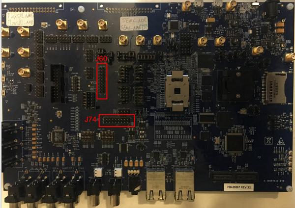
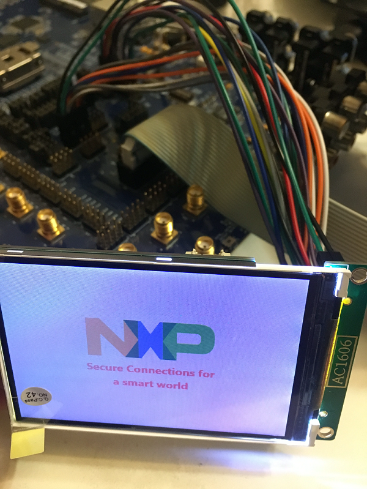

# NXP Application Code Hub
[](https://www.nxp.com)

## AN12822: Emulating 8080 Bus with the FlexIO on RT1050
This application note describes how to use the FlexIO module to emulate the 8080 parallel bus and to drive a graphic TFT LCD with the 8080 bus interface on the i.MX RT1050-EVB board.

Please refer to [AN12822](https://www.nxp.com/docs/en/application-note/AN12822.pdf) for complete instructions on how to use this software. 

#### Boards: Custom Board(i.MX RT1050-EVB)
#### Categories: Graphics
#### Peripherals: DISPLAY
#### Toolchains: IAR

## Table of Contents
1. [Software](#step1)
2. [Hardware](#step2)
3. [Setup](#step3)
4. [Results](#step4)
5. [FAQs](#step5)
6. [Support](#step6)
7. [Release Notes](#step7)

## 1. Software<a name="step1"></a>
- SDK: 2.6.0
- Toolchain: IAR Embedded Workbench 8.32.3

## 2. Hardware<a name="step2"></a>
- X-IMXRT512-EVB REV A1 board
- HX8357 LCD module
- J-Link Debugger

## 3. Setup<a name="step3"></a>
1. Connect the HX8357 LCD module to J60 and J74 of i.MX RT1050-EVB as shown in the figure and table below.  

```
   Pins	    | Board Connector | LCD Signal
------------+-----------------+-----------
 FlexIO2_12 |      J60-10     |    D0
 FlexIO2_13 |      J60-8      |    D1
 FlexIO2_14 |      J60-6      |    D2
 FlexIO2_15 |      J60-4      |    D3
 FlexIO2_16 |      J74-3      |    D4
 FlexIO2_17 |      J74-5      |    D5
 FlexIO2_18 |      J74-7      |    D6
 FlexIO2_19 |      J74-9      |    D7
 FlexIO2_20 |      J74-11     |    D8
 FlexIO2_21 |      J74-13     |    D9
 FlexIO2_22 |      J74-15     |    D10
 FlexIO2_23 |      J74-17     |    D11
 FlexIO2_24 |      J74-18     |    D12
 FlexIO2_25 |      J74-16     |    D13
 FlexIO2_26 |      J74-14     |    D14
 FlexIO2_27 |      J74-12     |    D15
 FlexIO2_00 |      J60-3      |    WR
 FlexIO2_01 |      J60-5      |    RD
 GPIO2_02   |      J60-7      |    RS
 GPIO2_03   |      J60-9      |    CS
 GND	    |      J60-2      |    GND
 VCC	    |      J60-1      |    3V3
```
2. Connect J-Link debugger to J61 of i.MX RT1050-EVB. 
3. Build and download the demo to the target board.

## 4. Results<a name="step4"></a>
When the demo runs successfully, a picture of NXP logo is shown on the LCD screen, as shown in the following figure.  


## 5. FAQs<a name="step5"></a>

## 6. Support<a name="step6"></a>
If you have questions, please create a ticket in NXP Community.


#### Project Metadata
<!----- Boards ----->


<!----- Categories ----->
[](https://github.com/search?q=org%3Anxp-appcodehub+graphics+in%3Areadme&type=Repositories)

<!----- Peripherals ----->
[](https://github.com/search?q=org%3Anxp-appcodehub+display+in%3Areadme&type=Repositories)

<!----- Toolchains ----->
[](https://github.com/search?q=org%3Anxp-appcodehub+iar+in%3Areadme&type=Repositories)

Questions regarding the content/correctness of this example can be entered as Issues within this GitHub repository.

>**Warning**: For more general technical questions regarding NXP Microcontrollers and the difference in expected funcionality, enter your questions on the [NXP Community Forum](https://community.nxp.com/)

[](https://www.youtube.com/@NXP_Semiconductors)
[](https://www.linkedin.com/company/nxp-semiconductors)
[](https://www.facebook.com/nxpsemi/)
[](https://twitter.com/NXP)

## 6. Release Notes<a name="step7"></a>
| Version | Description / Update                           | Date                        |
|:-------:|------------------------------------------------|----------------------------:|
| 1.0     | Initial release on Application Code HUb        | June 13<sup>th</sup> 2023 |

